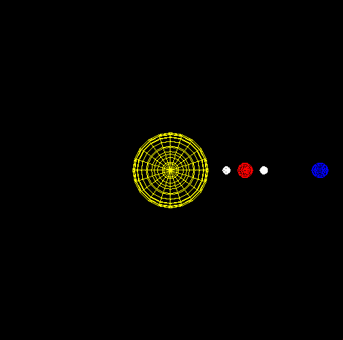
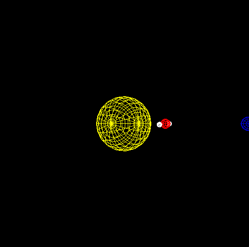

# 🌌 Sistema de Rotação de Planetas em OpenGL / Planet Rotation System in OpenGL

Este projeto é uma **atividade prática** desenvolvida para a disciplina de **Computação Gráfica** do curso de **Ciência da Computação**.  
This project is a **practical assignment** developed for the **Computer Graphics** course in the **Computer Science** program.

O objetivo é criar uma **simulação simplificada do sistema solar**, mostrando a **translação de dois planetas ao redor do Sol** e **duas luas orbitando um dos planetas**, usando a biblioteca **OpenGL** com **GLUT**.  
The goal is to create a **simplified solar system simulation**, showing the **translation of two planets around the Sun** and **two moons orbiting one of the planets**, using **OpenGL** with **GLUT**.

## 🚀 Funcionalidades / Features

- Desenho do **Sol**, **dois planetas** e **duas luas** utilizando `glutWireSphere`.  
  Draw the **Sun**, **two planets**, and **two moons** using `glutWireSphere`.
- Um planeta gira em torno do Sol para a esquerda e o outro para a direita ao pressionar a tecla `Y`.  
  One planet rotates around the Sun to the left and the other to the right when pressing the `Y` key.
- Duas luas orbitam o planeta correspondente:
  - Uma gira ao longo do eixo X.  
    One moon rotates along the X axis.
  - Outra gira ao longo do eixo XY.  
    The other moon rotates along the XY axis.
- Controle interativo via teclado:  
  Interactive keyboard controls:
  - `d` / `D`: girar os corpos celestes sobre o próprio eixo (dia)  
    Rotate celestial bodies on their own axis (day)
  - `y` / `Y`: simular a rotação em torno do Sol (ano)  
    Simulate rotation around the Sun (year)
  - `q`: sair do programa / quit the program
- Dois modos de visualização possíveis (comentado):  
  Two possible view modes (commented in code):
  - **Visão frontal / Frontal view** (ativa / active)
  - **Visão de cima / Top view** (comentada / commented)

## 🎬 Demonstração dos Movimentos / Movements Demo

### 🔄 Rotação sobre o próprio eixo / Rotation on its own axis
- Pressione **D** / Press **D** para girar os planetas e luas ao redor de seus próprios eixos.  

### 🪐 Translação ao redor do Sol / Translation around the Sun
- Pressione **Y** / Press **Y** para movimentar os planetas ao redor do Sol.  

## 🛠 Tecnologias / Technologies

- Linguagem / Language: **C**
- Biblioteca gráfica / Graphics library: **OpenGL / GLUT**

## 📚 Aprendizados / Learning Outcomes

- Aplicação de **matrizes de transformação** para simulação de órbitas.  
  Applying **transformation matrices** to simulate orbits.
- Uso de **pilha de matrizes** (`glPushMatrix` e `glPopMatrix`) para hierarquia de movimentos.  
  Using **matrix stack** (`glPushMatrix` and `glPopMatrix`) for movement hierarchy.
- Manipulação de **teclado** e **viewport** para interação e visualização.  
  Handling **keyboard** and **viewport** for interaction and visualization.

## 🧑‍💻 Autor / Author

Felipe Gabriel Marques dos Santos  
Disciplina: Computação Gráfica / Course: Computer Graphics  
Curso: Ciência da Computação / Program: Computer Science
